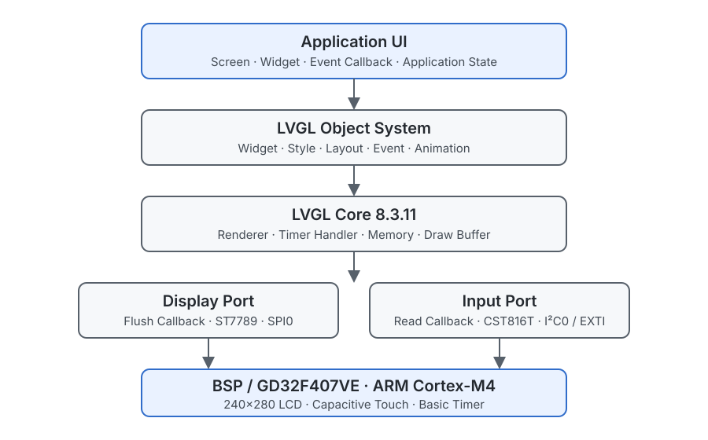

# LVGL-Embedded-GUI-Lab

基于 LVGL V8.3.11 与 GD32F407VE / ARM Cortex-M4 的嵌入式 GUI 架构与显示系统实践仓库，重点展示显示刷新、触摸输入、渲染缓冲、事件处理和 UI 模块组织。

## Overview

仓库围绕嵌入式 GUI 的完整软件路径组织独立工程：应用页面和 Widget 产生界面状态，LVGL Runtime 管理对象、样式、布局与事件，Display/Input Port 连接 ST7789 显示和 CST816T 触摸接口。

PC SDL、裸机 GD32、CMSIS Pack 和 FreeRTOS 工程用于呈现不同运行环境下的接口组织方式。它们保持各自的工程边界，不被描述成连续升级完成的产品，也不据此声明线程安全保证或生产级 UI 能力。

## Platform & Technology

| Field | Value |
| --- | --- |
| Language | C |
| Platform | GD32F407VE / ARM Cortex-M4; PC SDL simulation path |
| Toolchain | Keil MDK-ARM, GCC, CMake, SDL2 |
| Architecture | LVGL V8.3.11, Display, Input, Rendering, Event, bare-metal and FreeRTOS integration |
| Verification | Project structure and interface review; build and hardware status are listed below |

## Architecture



Application UI 保存页面、Widget 和应用状态；LVGL Object System 处理 Style、Layout、Event 与 Animation；LVGL Core 负责对象刷新和渲染；Display Port 与 Input Port 分别连接刷新回调和触摸读取；BSP/Driver Layer 再连接 ST7789、CST816T、SPI0、I²C0、EXTI 与基础定时器。

当前显示路径使用局部 draw buffer 和同步 flush callback。仓库没有将 GD32 DMA、DMA2D、LTDC、GPU acceleration 或不存在的 UI 分层描述为当前实现。

## Key Features

| Capability | Implementation Entry |
| --- | --- |
| Display management | [Display and Touch Bring-up](projects/02-display-touch-bringup/) 与 [Display Pipeline](docs/display-pipeline.md) 展示 ST7789、SPI0 和 flush callback 路径 |
| Rendering flow | [LVGL Porting](projects/03-lvgl-porting/) 与 [Rendering and Buffer](docs/rendering-and-buffer.md) 说明 draw buffer、失效区域和刷新接口 |
| Input processing | [Input and Events](docs/input-and-events.md) 展示 CST816T 状态、坐标和 LVGL pointer device 数据之间的映射 |
| Event-driven UI | [Bare-metal SmartWatch](projects/04-baremetal-smartwatch/) 与 [Screen Navigation](docs/screen-navigation.md) 组织 Widget callback、页面状态和界面切换 |
| Runtime integration | [PC SDL Simulator](projects/01-pc-simulator/) 和 [FreeRTOS SmartWatch](projects/05-rtos-smartwatch/) 展示桌面与 MCU 运行环境中的接口边界 |
| Resource boundary | [Fonts and Images](docs/fonts-and-images.md) 记录字体、图标、图片和生成资源的公开范围 |

## Project Structure

```text
LVGL-Embedded-GUI-Lab/
├── projects/01-pc-simulator/             # SDL 显示与输入接口
├── projects/02-display-touch-bringup/    # ST7789 与 CST816T 驱动路径
├── projects/03-lvgl-porting/             # Display、Input、Tick 与 Handler Port
├── projects/04-baremetal-smartwatch/     # 裸机页面与事件组织
├── projects/05-rtos-smartwatch/          # FreeRTOS GUI 任务结构
├── projects/reference/                   # CMSIS Pack 工程组织参考
├── docs/                                 # 显示、输入、渲染、事件与资源文档
└── assets/images/                        # 已有自绘架构与数据流 SVG
```

## Documentation

- [LVGL Porting](docs/lvgl-porting.md)
- [Display Pipeline](docs/display-pipeline.md)
- [Rendering and Buffer](docs/rendering-and-buffer.md)
- [Input and Events](docs/input-and-events.md)
- [Widgets and Layout](docs/widgets-and-layout.md)
- [Screen Navigation](docs/screen-navigation.md)
- [Fonts and Images](docs/fonts-and-images.md)
- [FreeRTOS Integration](docs/rtos-integration.md)
- [Development Environment](docs/development-environment.md)

## Verification

| Verification Type | Status | Boundary |
| --- | --- | --- |
| Host Test | NOT VERIFIED | PC SDL 工程入口存在，但仓库未提供成功配置、构建和运行的可复核记录 |
| Build Verification | NOT VERIFIED | CMake 与 Keil 工程定义存在，但仓库未提供与当前公开版本对应的成功构建记录 |
| Hardware Validation | NOT VERIFIED | 仓库未提供可复核的 GD32F407VE、ST7789 或 CST816T 板端验证记录 |
| Runtime Evidence | NOT INCLUDED | 仓库未提供本地运行截图、串口日志、显示刷新测量或触摸交互记录 |

工程入口、驱动接口和 UI 代码存在，不等同于主机构建成功、MCU 构建成功、显示触摸实测或性能保证。

## License Boundary

根目录 [MIT License](LICENSE) 仅适用于仓库新增并明确覆盖的 Markdown 文档和自绘 SVG。LVGL、GigaDevice/CMSIS 组件、FreeRTOS 引用、SquareLine Studio 生成的 UI 结构和 Unscii 字体数据继续适用各自的声明，具体边界见 [THIRD_PARTY_NOTICES.md](THIRD_PARTY_NOTICES.md) 与 [Fonts and Images](docs/fonts-and-images.md)。
