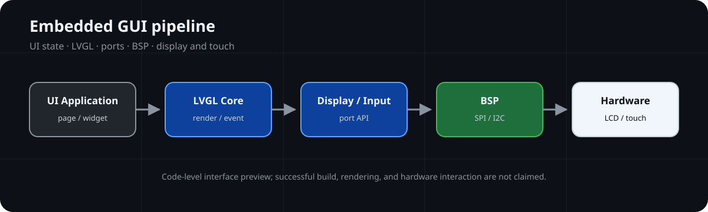

# LVGL-Embedded-GUI-Lab

面向 Cortex-M 的 LVGL 显示、输入、渲染缓冲与事件架构文档实验。

**🖥️ GUI Runtime Pipeline**



## GUI Snapshot

| GUI Focus | Current Scope |
| --- | --- |
| Repository Type | Embedded GUI Architecture Lab |
| Reference Runtime | LVGL 8.3.11 concepts |
| Display Model | Draw buffer → flush callback → display interface |
| Input Model | Touch state → pointer mapping → event dispatch |
| Public Implementation | Not included in the current default branch |
| Verification | Architecture review；build, rendering and hardware evidence not provided |

## 📌 Overview

仓库以原创文档和 SVG 整理嵌入式 GUI 的对象、样式、布局、事件、渲染缓冲、display flush、touch input 与 RTOS integration 边界。

当前默认分支不分发 LVGL/lv_drivers 源码、课程 UI、SquareLine 输出、GD32/CMSIS/FreeRTOS 组件、字体、图标、表盘素材或外部图片。ST7789、CST816T 和 PC SDL 仅作为架构参考，不代表当前存在可构建实现。

## 🏗️ Architecture


```text
Application UI / Page State
            ↓
Objects / Styles / Layout / Events
            ↓
Rendering and Draw Buffer
            ↓
Display Port + Input Port
            ↓
Display / Touch Hardware Boundary
```

## ✨ Key Features

| Capability | Documentation Entry |
| --- | --- |
| Porting boundaries | [LVGL Porting](docs/lvgl-porting.md) |
| Display and flush flow | [Display Pipeline](docs/display-pipeline.md) |
| Buffer and invalidation model | [Rendering and Buffer](docs/rendering-and-buffer.md) |
| Input and event mapping | [Input and Events](docs/input-and-events.md) |
| Widgets and navigation | [Widgets and Layout](docs/widgets-and-layout.md) and [Screen Navigation](docs/screen-navigation.md) |
| Asset boundary | [Fonts and Images](docs/fonts-and-images.md) |

## 📂 Project Structure

```text
LVGL-Embedded-GUI-Lab/
├── README.md
├── LICENSE
├── THIRD_PARTY_NOTICES.md
├── assets/images/  # Repository-authored architecture and flow SVG
└── docs/           # Embedded GUI architecture documentation
```

## 📚 Documentation

- [LVGL Porting](docs/lvgl-porting.md)
- [Display Pipeline](docs/display-pipeline.md)
- [Rendering and Buffer](docs/rendering-and-buffer.md)
- [Input and Events](docs/input-and-events.md)
- [Widgets and Layout](docs/widgets-and-layout.md)
- [Screen Navigation](docs/screen-navigation.md)
- [Fonts and Images](docs/fonts-and-images.md)
- [RTOS Integration](docs/rtos-integration.md)
- [Development Environment](docs/development-environment.md)

## 🧪 Verification

| Verification Layer | Status | Boundary |
| --- | --- | --- |
| Host Test | NOT PROVIDED | No PC SDL implementation is distributed |
| Build Verification | NOT PROVIDED | No current CMake, Keil, LVGL or driver source is distributed |
| Hardware Validation | NOT PROVIDED | No reviewable display or touch result |
| Runtime Evidence | NOT PROVIDED | No screenshot, trace, frame-rate result, or interaction log |

## License Boundary

根目录 MIT License 仅覆盖当前默认分支中仓库维护者编写的文档、配置与自绘 SVG。LVGL、lv_drivers、SquareLine 输出、字体、图标、厂商组件和课程 UI 未包含在当前默认分支；历史提交风险单独保留。详见 [THIRD_PARTY_NOTICES.md](THIRD_PARTY_NOTICES.md)。
