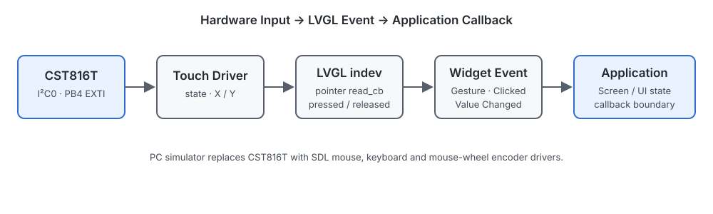

# LVGL 嵌入式 GUI 实验室
## LVGL Embedded GUI Lab

基于 LVGL 8.3.11 与 GD32F407VE / ARM Cortex-M4，整理显示移植、触摸输入、渲染缓冲、事件系统和多页面 GUI 的工程关系。


## 👋 项目简介 | Overview

仓库从 PC SDL 仿真进入 MCU 显示与触摸 bring-up，再连接 LVGL port、Widget/Event、多页面 UI 和 FreeRTOS 承载方式。公开工程按技术价值筛选，未收录安装程序、完整上游 demos/examples、构建产物及授权不明视觉资源。

技术主线：

```text
PC SDL Simulator
        ↓
Display / Touch Bring-up
        ↓
LVGL Porting
        ↓
Widget / Event / Screen Navigation
        ↓
Bare-metal / CMSIS / FreeRTOS Integration
```

## ⚙ 技术范围 | Technical Scope

### Display

- GD32F407VE / Cortex-M4
- SPI0 / ST7789
- 240 × 280 / RGB565 / 16-bit byte swap
- Partial double buffer
- Polling / synchronous flush

### Input

- CST816T capacitive touch
- I²C0 + EXTI
- LVGL pointer input
- SDL mouse / keyboard / mouse-wheel encoder

### UI

- Widget / Style / Event
- Gesture-driven screen navigation
- SquareLine generated UI structure
- Bare-metal and FreeRTOS project organization

## 🖥 显示链路 | Display Pipeline


主线使用两个 `240 × 10` 像素 draw buffer。`flush_cb` 将局部刷新区域交给 ST7789 驱动，经 SPI0 同步写入后调用 `lv_disp_flush_ready()`。当前工程没有 GD32 DMA、DMA2D 或 GPU 加速链路。

详细说明：[Display Pipeline](docs/display-pipeline.md) · [Rendering and Buffer](docs/rendering-and-buffer.md)

## 👆 输入与事件 | Input & Events



CST816T 驱动提供触摸状态和坐标，LVGL input read callback 将其转换为 pointer device 数据；Widget 事件再连接页面切换或应用回调。PC simulator 使用 SDL 输入设备验证相同的事件模型。

详细说明：[Input and Events](docs/input-and-events.md)

## 🎨 UI 系统 | UI System

SmartWatch 工程族包含 4 个 screen，使用 Gesture、Clicked、Value Changed 与 Screen Load 事件。生成代码中部分 callback 直接访问 LED 等硬件接口，属于 UI 与应用逻辑部分耦合的参考结构，不描述为 MVC/MVVM。

无法建立再分发依据的生成字体、图标和表盘素材未随公开快照发布；已核对许可的 Unscii ASCII 生成字体保留。相关 SmartWatch 目录用于代码结构审查，不作为可独立构建的完整视觉资源包。

## 🧠 GUI 架构 | GUI Architecture

```text
Application State / Hardware Callback
                 ↑
Screen / Widget → Event Callback
                 ↓
              LVGL Core
                 ↓
       Display Port / Input Port
                 ↓
          BSP / GD32F407VE
```

FreeRTOS 变体将 UI 更新和 `lv_timer_handler()` 放在不同任务中，但未发现 GUI mutex。仓库只记录现有调用关系，不将其描述为 thread-safe LVGL integration。

## 🚀 核心工程 | Featured Projects

### [PC SDL Simulator](projects/01-pc-simulator/)

使用 SDL display/input 在桌面环境组织 LVGL UI 和事件处理。

### [Display / Touch Bring-up](projects/02-display-touch-bringup/)

验证 GD32F407VE、ST7789 与 CST816T 的底层显示和触摸接口结构。

### [LVGL Porting Template](projects/03-lvgl-porting/)

连接 `lv_conf.h`、display/input port、tick、handler 与局部双缓冲。

### [Bare-metal SmartWatch](projects/04-baremetal-smartwatch/)

在 GD32 裸机工程中组织多页面 UI、RTC 更新、Gesture 与硬件 callback。

### [FreeRTOS SmartWatch](projects/05-rtos-smartwatch/)

记录 FreeRTOS V10.5.1 中 GUI task、handler task 与 tick hook 的调用关系。

CMSIS Pack 组织方式放在 [reference](projects/reference/cmsis-pack-smartwatch/) 中，不与主线工程平级展开。

## 📂 工程结构 | Repository Structure

```text
assets/images/       自有架构与数据流 SVG
docs/                移植、显示、输入、UI 与 RTOS 说明
projects/            5 个主线工程和 1 个参考工程
  */course/          保持原始字节的白名单源码快照
SOURCE_SELECTION_MANIFEST.csv
MIGRATION_HASH_VERIFICATION.csv
```

## 🛠 开发环境 | Development Environment

- LVGL 8.3.11
- GD32F407VE / ARM Cortex-M4
- Keil MDK-ARM / GD32F4xx device support
- GD32 Standard Peripheral Library
- GCC / CMake / SDL2 simulator
- SquareLine Studio 1.4.1 generated UI structure
- FreeRTOS V10.5.1（单一 GD32 变体）

本阶段未完成自动化构建验证；工程存在和哈希一致不等于编译或板端运行通过。

## 📖 技术文档 | Documentation

- [LVGL Porting](docs/lvgl-porting.md)
- [Display Pipeline](docs/display-pipeline.md)
- [Rendering and Buffer](docs/rendering-and-buffer.md)
- [Input and Events](docs/input-and-events.md)
- [Widgets and Layout](docs/widgets-and-layout.md)
- [Screen Navigation](docs/screen-navigation.md)
- [Fonts and Images](docs/fonts-and-images.md)
- [FreeRTOS Integration](docs/rtos-integration.md)
- [Development Environment](docs/development-environment.md)

## 📜 来源与许可 | License

仓库新增文档和自有 SVG 使用根目录 [MIT License](LICENSE)。参考工程及第三方组件继续适用其原有声明，具体边界见 [THIRD_PARTY_NOTICES.md](THIRD_PARTY_NOTICES.md)。
