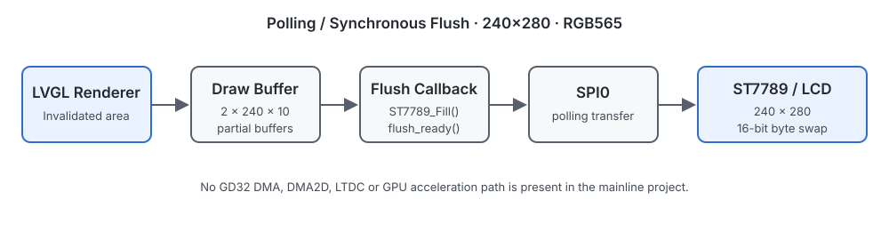

# 显示链路 | Display Pipeline

GD32 主线使用 SPI0 将 draw buffer 中的像素写入 ST7789 控制器。LVGL renderer、flush callback 和物理传输分别承担区域渲染、刷新提交与 LCD 写入；硬件资料标注 ST7789V，工程驱动统一使用 ST7789 命名。



## 主线配置

- MCU：GD32F407VE / ARM Cortex-M4。
- Display interface：SPI0 polling transfer。
- Controller：ST7789。
- Resolution：240 × 280。
- Color：16-bit RGB565 with byte swap。

## Flush 路径

```text
Invalidated Object Area
          ↓
LVGL Renderer
          ↓
Current Draw Buffer
          ↓
Display Flush Callback
          ↓
ST7789_Fill(area, color_p)
          ↓
SPI0 / LCD
          ↓
lv_disp_flush_ready()
```

`flush_cb` 不是 renderer。它接收 LVGL 已渲染的区域和像素指针，在 `ST7789_Fill()` 返回后调用 `lv_disp_flush_ready()`，属于同步完成路径。主线没有异步 DMA completion callback，也没有 DMA2D、LTDC 或 GPU acceleration。

## 硬件边界

显示工程包含底层初始化和区域写入接口；本仓库不把通用 SPI 外设配置扩展成独立教程。底层外设基础对应 [ARM Cortex-M Development Lab](https://github.com/REliasCheng/ARM-Cortex-M-Development-Lab)。

## 相关工程

- [Display / Touch Bring-up](../projects/02-display-touch-bringup/)
- [LVGL Porting Template](../projects/03-lvgl-porting/)
- [Rendering and Buffer](rendering-and-buffer.md)
- 下一层：[Input and Events](input-and-events.md)
